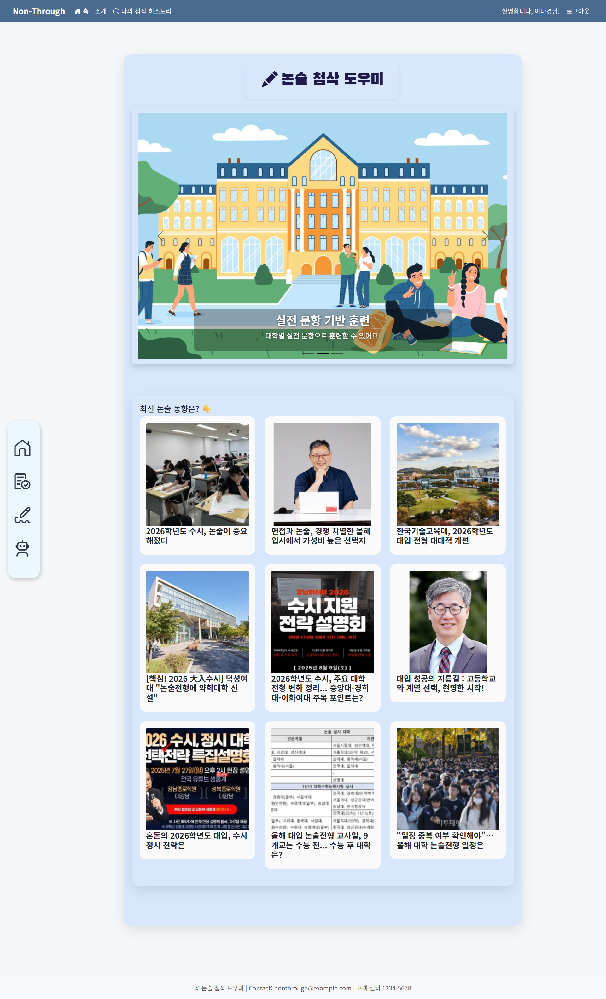
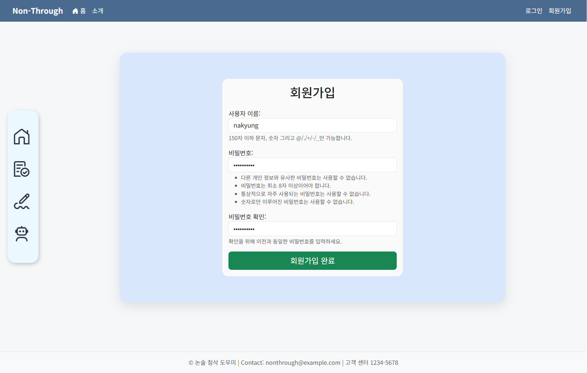
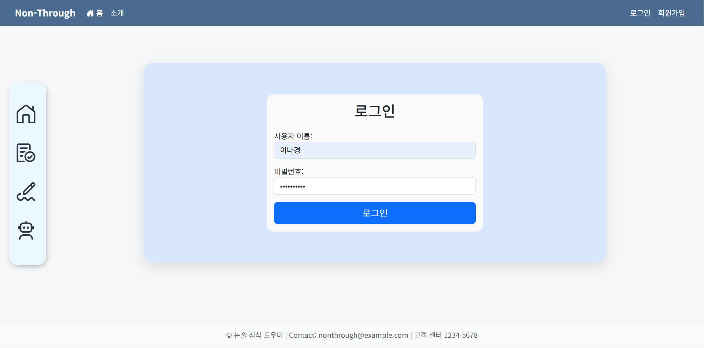
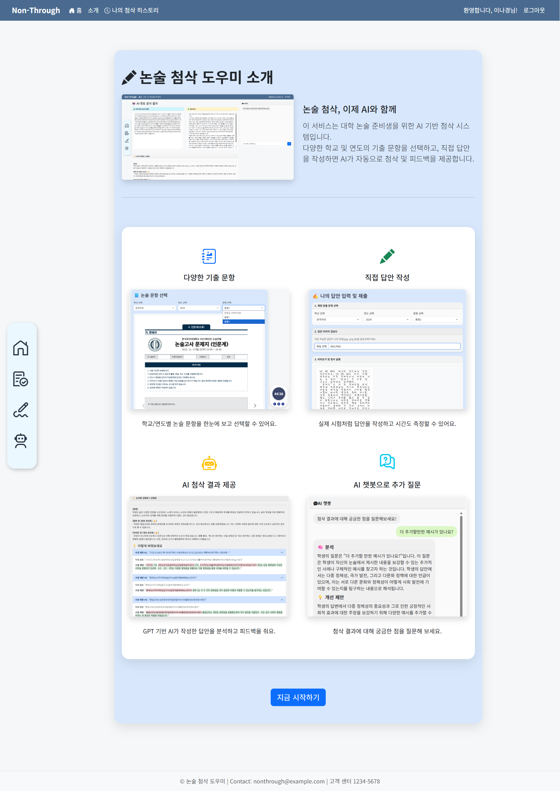
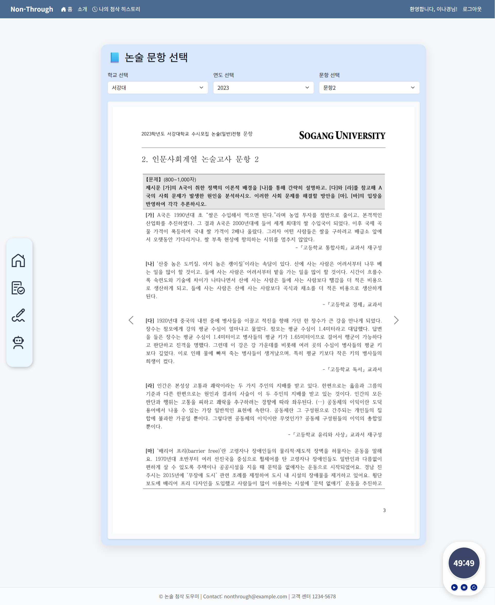
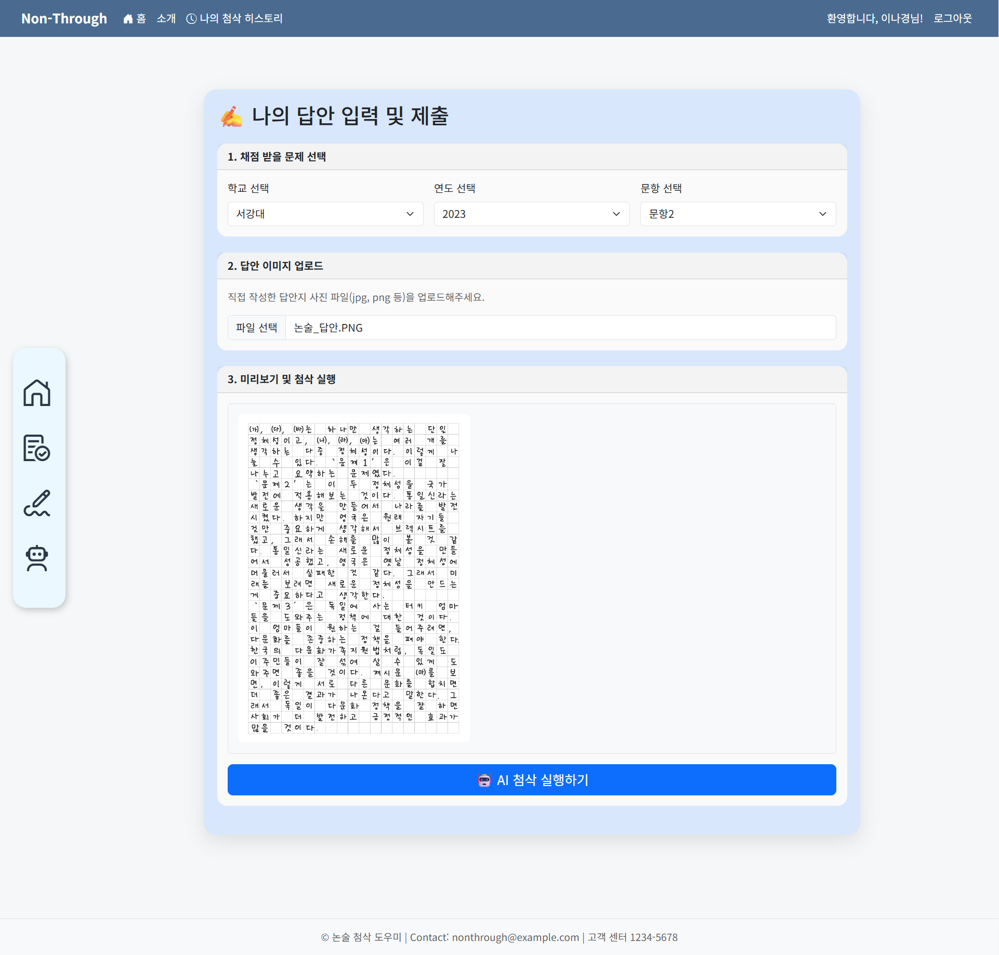
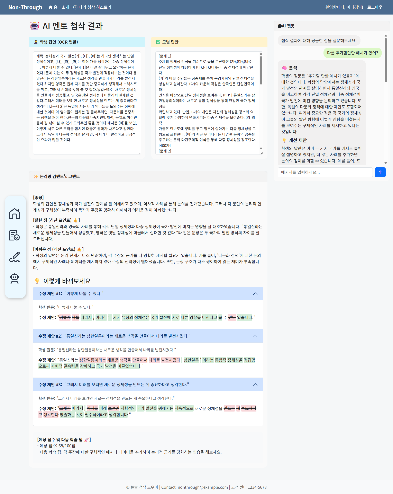
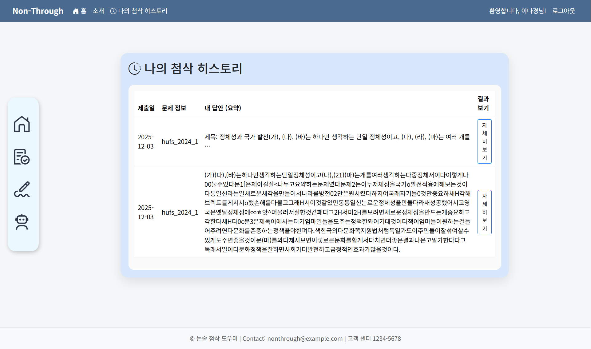

# 📝AI 논술 첨삭 멘토봇🤖
> **개발 기간:** 2025.07.16 ~ 2025.07.17(v1) / 2025.08.07 ~ 2025.08.08(v2)

## 📌 목차
1. [프로젝트 개요](#1️⃣-프로젝트-개요)
2. [기술 스택](#2️⃣-기술-스택)
3. [프로젝트 산출물 구조](#3️⃣-프로젝트-산출물-구조)
4. [주요 기능](#4️⃣-주요-기능)
5. [시연 영상](#5️⃣-시연-영상)
6. [실행 방법](#6️⃣-실행-방법)
7. [프로젝트 성과 및 한계](#7️⃣-프로젝트-성과-및-한계)
8. [회고](#8️⃣-회고)
9. [그 외 관련 자료](#9️⃣-그-외-관련-자료)

## 1️⃣ 프로젝트 개요
### 1. 프로젝트 소개
본 프로젝트는 LLM 기반의 RAG(Retrieval-Augmented Generation) 구조를 활용한 **대학 논술 첨삭 보조 시스템**입니다.
<br>사용자가 작성한 논술 답안을 **OCR로 텍스트화**한 뒤 이를 바탕으로 해당 문항의 **채점 기준·출제 의도·예시 답안을 검색하고 분석**하여 구체적이고 구조적인 피드백을 제공합니다.<br>또한 사용자 답안을 기반으로 **문장 단위 피드백·보충 설명·추가 질의가 가능한 Q&A 챗봇** 기능도 지원합니다.

더불어, 기존 Streamlit 기반의 프로토타입(v1)을 보다 확장성 있고 안정적인 웹 프레임워크인 **Django(v2)와 Bootstrap으로 재구축**했고 AWS 환경에서 실제 배포가 가능한 형태로 고도화했습니다.

> 핵심 목적: **RAG 기반 자동 첨삭 → 고품질 피드백 제공 → 학습 효율·합격 가능성 향상**

### 2. 필요성 및 배경
- 대학 논술 준비생의 **자기주도 학습 도구 부족**
- 전문가 수준의 첨삭을 받기 위한 **비용 및 시간 부담** 존재
- 논술의 구조적 접근법(출제 의도 → 채점 기준 → 예시 답안 → 자기 답안 분석)을 도와줄 Tool 부재
- GPT와 벡터 검색(RAG)을 접목해 **문항별 맥락을 반영한 피드백 제공의 필요성** 대두

**_"논술, 꼭 학원에 가야만 할까?"_**

대학 논술은 감각적인 글쓰기처럼 보이지만 출제자는 언제나 반복적인 구조 안에서 문제를 내고, 대학마다 정해진 **채점 기준과 논리적 설득력**을 바탕으로 답안을 평가합니다.

따라서 논술학원의 존재 자체가 **논술에 분석 가능한 패턴과 가이드**가 있음을 보여주며 이러한 특성은 AI를 활용해 충분히 재현할 수 있다는 가능성에서 출발해 이 프로젝트를 시작했습니다.

여러 가능성에 대한 고민 끝에 학원을 대체할 수 있는 **나만의 AI 논술 멘토**를 기획했습니다. 대학별 논술 데이터를 구조화하고, RAG 기반 정보 검색과 대형 언어 모델을 활용한 첨삭 시스템을 통해 논술학원 없이도 체계적인 훈련이 가능하도록 하고자 했습니다.

### 3. 기대효과 및 전략
- **학생 개인의 자기주도 학습 향상**
    - AI 피드백을 통해 **반복 학습 및 자기 수정 능력** 향상
    - 시간, 장소에 구애받지 않고 첨삭 서비스 접근 가능
- **교육 자원의 효율적 활용**
    - 교사와 강사의 피드백 부담을 줄이고, **개별 맞춤형 학습** 지원
    - 과거 논술 문항 데이터 기반으로 지속적인 서비스 고도화 가능
- **논술에 대한 심리적 거리감 해소**
    - 구조화된 피드백과 친근한 설명을 통해 **논술에 대한 접근성 향상**
    - **실시간 Q&A 챗봇**으로 학습 동기 및 흥미 유도
- **AI 기술을 활용한 교육 격차 해소**
    - 수도권과 비수도권 간 논술 교육 기회의 격차 완화
    - **비용 부담 없이** 양질의 피드백 경험 제공

## 2️⃣ 기술 스택
| 구분 | 사용 기술 |
|------|-----------|
| 협업 & 문서화 | Discord, Notion |
| 개발 환경 | VS Code |
| 버전 관리 | Git, GitHub |
| Backend | Python, Django |
| Frontend | Streamlit, HTML, CSS, JavaScript, Bootstrap 5 |
| Vector DB | FAISS (Facebook AI Similarity Search) |
| AI / LLM | LangChain, OpenAI API (gpt-4o-mini) |
| OCR | PaddleOCR |
| Etc | PyMuPDF (PDF 처리) |
| Deploy | AWS |

## 3️⃣ 프로젝트 산출물 구조
```
📂 Essay_Feedback_Assistant/
├── 📂 01_data_preprocessing/   # 수집된 데이터 및 데이터 전처리 문서
├── 📂 02_system_architecture/  # 시스템 구성도
├── 📂 03_requirements_spec/    # 요구사항 정의서
├── 📂 04_ui_wireframe/         # 화면설계서
├── 📂 05_test_report/          # 테스트 계획 및 결과 보고서
└── 📂 project/                 # 개발된 LLM 연동 웹 애플리케이션
```

## 4️⃣ 주요 기능
### 1. 메인 페이지
> - 좌측에 아이콘 네비게이션 바를 배치(hover 시 기능명이 나타나는 인터랙션 적용)하여 **문항 선택, 나의 답안 입력, AI 첨삭 결과 등 핵심 기능에 즉시 접근** 가능
> - 상단 영역은 Bootstrap 캐러셀로 구성하여 서비스 주요 기능을 자동 슬라이드 방식으로 안내
> - 각 캐러셀 슬라이드를 클릭하여 해당 기능 페이지로 이동 가능
> - **최신 논술·입시 관련 기사**를 카드 형태로 구성하여 논술 준비생에게 필요한 **실시간 정보 및 동향**을 빠르게 확인



### 2. 회원가입/로그인
> - Django Authentication 기반 사용자 관리 기능
> - 로그인 상태에 따라 접근 가능한 메뉴가 달라지며, **첨삭 히스토리 저장 기능을 위한 필수 절차**




### 3. 서비스 소개
> - 서비스의 전체 흐름과 사용 방법을 시각적으로 정리해 제공하는 **안내 매뉴얼** 역할
> - 처음 방문한 사용자도 서비스 구조와 활용 방식을 한눈에 확인할 수 있도록 **실제 화면 예시**도 함께 제공



### 4. 문항 선택
> - 학교·연도·문항 드롭다운을 선택하면 해당 문항의 **기출 문제 이미지 슬라이드** 제공
> - 시간 관리를 위한 **타이머 기능**도 제공하여 **실전과 동일한 환경** 설정 가능



### 5. 답안 작성 및 업로드
> - 사용자가 직접 작성한 **논술 답안을 이미지 파일로** 업로드
> - 업로드 즉시 미리보기가 제공되어 **답안 상태·화질·구성 확인 후 제출**
> - 선택한 문항과 연동되도록 **`question_id` 자동 매핑**



### 6. OCR 추출 → 모범답안 비교 → 첨삭 결과 및 코멘트 → 추가 질문 챗봇
> - 업로드된 답안 이미지에서 **OCR로 텍스트 추출**(PaddleOCR)
> - **벡터 기반 RAG 검색**으로 해당 문항의 모범답안과 학생 답안을 나란히 비교하여 가독성 향상
> - GPT 기반 AI가 논리·내용·표현·문법 등을 다각적으로 분석 후 첨삭
> - **문단 단위 분석 및 종합 피드백 + 주요 문제점 강조 + 수정 전략 제안** 형태로 다단계 피드백 제공
> - AI 챗봇에서 **후속 질문**을 하면 학생 답안과 문항 정보 등의 벡터 기반 검색을 활용하여 맞춤 답변함으로써 학생이 추가로 궁금한 부분에 대한 **1:1 맞춤 설명** 제공



### 7. 첨삭 히스토리
> - **이전 첨삭 기록**을 날짜·문제·요약 형태로 조회
> - 클릭 시 해당 첨삭의 상세 페이지로 이동하여 **학습 진행 상황 추적**
> - **지속적인 피드백 누적**을 통해 반복 학습 효과 강화



## 5️⃣ 시연 영상
### v2 (Django)
[](https://youtu.be/d-bMON8ZwnY?si=Y-Atkl_AOZvqmbsQ)

### v1 (Streamlit)
[](https://youtu.be/Y8IlV9xs8CQ?si=VyFnnb5e5TgEBSBT)


## 6️⃣ 실행 방법
**1. 환경 설정**
> 프로젝트 실행에 필요한 모든 Python 패키지는 `requirements.txt`에 정의
```bash
pip install -r requirements.txt
```
> 프로젝트 루트(manage.py가 있는 위치)에 `.env` 파일 생성 후 OpenAI API 키 입력
```
OPENAI_API_KEY="sk-..."
```
**2. 데이터베이스(MySQL) 설정**
> MySQL 서버 설치 후 아래 명령으로 `submitdb` 생성 및 `django` 계정 권한 설정
```
"mysql.exe 경로"  -u root -p < setup.sql

예) "C:\Program Files\MySQL\MySQL Server 8.0\bin\mysql.exe" -u root -p < setup.sql
```
**3. 데이터 전처리 (최초 1회 실행)**
> 중요⚠️: 실행 전 다음 폴더에 각 데이터를 올바른 위치에 넣어야 함
>  - `static/pdf/` 폴더 → 각 대학별 논술 PDF 파일
> - `data/json/` 폴더 → 각 대학별 JSON 데이터

> PDF 파일을 이미지로 변환
```bash
python convert_pdfs.py
```
> JSON과 이미지 데이터를 기반으로 `config.py` 파일 자동 생성
```bash
python generate_config.py
```
**4. Django 마이그레이션**
> MySQL의 `submitdb`에 필요한 모든 테이블 구조 생성
```bash
python manage.py migrate
```
**5. 관리자 계정(superuser) 생성**
> 관리자 페이지 접근 및 로그인 테스트용 계정 생성
```bash
python manage.py createsuperuser
```
_입력 예시_
```
사용자 이름: admin (원하는 이름)
이메일 주소: (생략 가능)
Password: ●●●●●● (원하는 비밀번호)
Password (again): ●●●●●● (비밀번호 재입력)
```
**6. 개발 서버 실행**
> 아래 명령어 실행 후 웹 브라우저에서 다음 주소로 접속하여 애플리케이션 실행
> - 메인 페이지: [http://127.0.0.1:8000](http://127.0.0.1:8000/)
> - 관리자 페이지: [http://127.0.0.1:8000/admin](http://127.0.0.1:8000/admin/)
```bash
python manage.py runserver
```
> Streamlit 기반의 웹 인터페이스(v1 옵션)는 아래 명령어로 실행
```bash
streamlit run 04_app/Home.py
```

## 7️⃣ 프로젝트 성과 및 한계
### 1. 성과
- **RAG 기반 논술 첨삭 시스템 설계 및 구현**
    -  PaddleOCR로 사용자 답안 이미지를 텍스트로 변환하는 OCR 파이프라인 구현
    - 각 문항별 채점 기준·예시답안·출제 의도를 Vector DB(FAISS)에 저장하여 문항 맥락 기반 Retrieval 적용
    - 검색된 문서+사용자 답안을 결합하여 LLM이 논리·내용·표현·문법 단위로 구조적 피드백 생성
    - Prompt Engineering을 반복하며 회차별 첨삭 품질이 개선되는 과정 실측
    - 챗봇(Q&A)을 추가하여 문장 단위 질의응답으로 후속 학습 지원

- **Django 기반 서비스 구조로 확장 (Streamlit v1 → Django v2)**
    - 기존 Streamlit 프로토타입(v1)의 한계를 개선하고 Django 기반(v2)으로 웹 서비스 재구축
    - HTML/CSS/Bootstrap으로 메인 페이지·소개 페이지를 사용자 입장에서 바라보며 직접 페이지 구조·UI·UX 개선
    - 이미지 업로드 → 미리보기 → 첨삭 실행의 흐름을 고려한 3단계 사용자 흐름 정교화

- **데이터 파이프라인 자동화**
    - `convert_pdfs.py`로 PDF → 이미지 변환을 전체 폴더 단위로 대량 파일 자동 처리
    - `generate_config.py`로 JSON + 이미지 기반 문항 구조를 자동 매핑
    - 신규 대학/연도/문항 데이터가 추가될 시 수동 수정 없이 자동 반영되는 구조로 추후 확장성 확보 및 유지보수 비용 감소

- **학습 히스토리 및 결과 조회 기능**
    - 사용자별 제출 답안·결과·첨삭 코멘트를 DB에 저장
    - 날짜/문항/요약 기반으로 목록을 확인하고 개별 세부 결과를 조회할 수 있는 시스템 구현
    - 이전 첨삭 피드백 결과를 확인하고 지속적으로 축적해나가며 학습 패턴 분석에 활용 가능한 구조 마련

- **안정적인 아키텍처 설계**
    - Django(Frontend/API) – FAISS(Retrieval) – OCR/LLM(Backend Utility) – MySQL(DB) 구조로 계층을 분리하여 유지보수성·확장성·협업 효율을 높인 구조 정립

### 2. 한계 및 개선 방향
- **데이터 다양성 및 품질 부족**
    - 현재 JSON 기반 문항 데이터는 구조화되어 있으나 실제 입시환경에서 제공되는 문제 지문·해설·다양한 예시답안 등의 정보는 아직 부족
    <br>**➡ 실제 대학 논술 PDF의 전수 수집 + 고품질 해설·예시답안 확충 필요**
    <br>**➡ 학교별 출제 특성을 반영하여 더 풍부하고 고도화된 데이터셋 구축**

- **OCR 성능 제약**
    - PaddleOCR는 인쇄체 중심으로, 글씨체·촬영 각도·해상도에 따라 OCR 성능이 저하되거나 인식 오류가 발생할 가능성이 큼
    <br>**➡ 기울기 보정(Deskew), 노이즈 제거(Noise Reduction) 등 추가하여 이미지 보정 성능 강화**
    <br>**➡ Donut·TrOCR 등 손글씨 OCR 특화 모델 적용 검토**

- **Retrieval & Prompting 안정성**
    - 프롬프트 구조 변화에 따라 응답 결과 품질의 편차 존재
    - 현재 Embed 기반 문서 검색의 Top-k 전략이 고정되어 있어 문항마다 최적값이 상이하며 이에 따라 최적 검색이 어려울 수 있음
    <br>**➡ Prompt Template 고도화, Query Rewriting, Retrieval Parameter 튜닝 등의 작업 필요**
    <br>**➡ Hybrid Search(BM25+Embedding), Re-ranking 적용 검토**

- **객관적 첨삭 품질 평가 지표 미흡**
    - 첨삭 품질을 객관적으로 평가할 명확한 정량 지표(BLEU, ROUGE, BERTScore 등) 부족
    - '좋은 피드백'에 대한 기준이 주관적이라 성능 개선 방향이 모호해질 수 있음
    <br>**➡ 채점 기준 기반 점수 비교(Alignment Score), 논리성 지표 등 평가 기준 설계 필요**

- **배포 및 모델 서빙 미완료**
    - 현재 Django 개발 서버 환경으로만 동작하며 로컬 실행 단계
    - OpenAI API 의존도가 높아 서비스 비용 및 안정성 문제 존재
    <br>**➡ Docker 기반 컨테이너화 → AWS EC2 / Elastic Beanstalk 배포**
    <br>**➡ Celery + Redis 기반 비동기 처리 적용(OCR/LLM 대기 시간 개선)**

## 8️⃣ 회고
이번 프로젝트는 개인적으로 가장 어려움을 느꼈던 강의 주간과 겹쳐 시작 단계에서 걱정이 컸습니다. 그러나 든든한 팀원들과 함께하며 초기의 부담을 하나씩 해소할 수 있었고, 팀에 누가 되지 않기 위해 맡은 역할을 충실히 수행하려 노력했습니다. 처음에는 익숙하지 않았던 RAG 개념이었지만 직접 검색·정제·프롬프트 설계를 반복하면서 시스템의 작동 원리를 확실히 이해할 수 있었습니다.

제가 주로 담당한 기능은 AI 챗봇(RAG 기반 답변 시스템) 구현이었습니다. 특히 프롬프트 구조를 고민하고 조정할수록 응답 품질이 눈에 띄게 향상되는 경험을 하며 프롬프팅의 중요성을 명확히 깨달았습니다. 또한 검색 대상 문서를 어떻게 구성하느냐에 따라 피드백의 맥락성이 달라지는 것을 직접 체감하며 데이터 정제와 문서 구조 설계가 LLM 성능에 얼마나 큰 영향을 미치는지 몸소 배울 수 있었습니다. 이 과정은 LLM 기반 애플리케이션을 실무적으로 구현하는 데 큰 자산이 되었습니다.

두 번째 버전(v2)에 대한 프로젝트에서는 단순 모델 구현을 넘어 사용자가 실제로 편리하게 사용할 수 있는 웹 서비스 형태로 만드는 과정이 포함되어 더욱 의미 있었습니다. Streamlit에서만 웹을 구성하던 이전 경험과 달리 Django를 활용해 직접 HTML/CSS/Bootstrap으로 UI를 설계해보며 한 단계 성장할 수 있었습니다.

특히 메인 페이지와 시스템 소개 페이지를 제작하면서 사용자가 처음 마주하는 화면이 어떤 인상을 주어야 하는지, 쉽고 직관적인 UI 흐름은 어떻게 구성해야 할지와 같은 사용자 경험 중심의 관점을 적극적으로 적용하려 노력했습니다. 이 과정 덕분에 웹 프레임워크에 대한 두려움도 많이 줄었고, 추후 기회가 된다면 AWS 기반 배포까지 진행해 서비스 완성도를 더 높여보고 싶다는 목표도 생겼습니다.

## 9️⃣ 그 외 관련 자료
- [🔗 팀 프로젝트 원본 저장소](https://github.com/skn-ai14-250409/SKN14-3rd-5Team)
- [🔗 발표 자료 v1 (Streamlit)](https://drive.google.com/file/d/1rX8quq0aSIkHryWgVijANwh3vEIeBWdn/view?usp=sharing)
- [🔗 발표 자료 v2 (Django)](https://drive.google.com/file/d/1QUpMn3sR6AdW1Xbxze76NP96qzyF_6CY/view?usp=sharing)
- **[📄 포트폴리오(PDF)] ### 추가 필요**